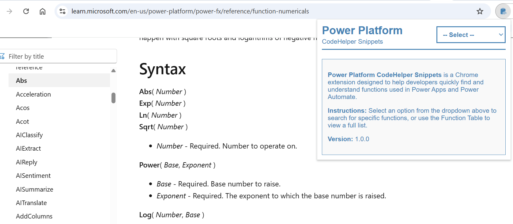
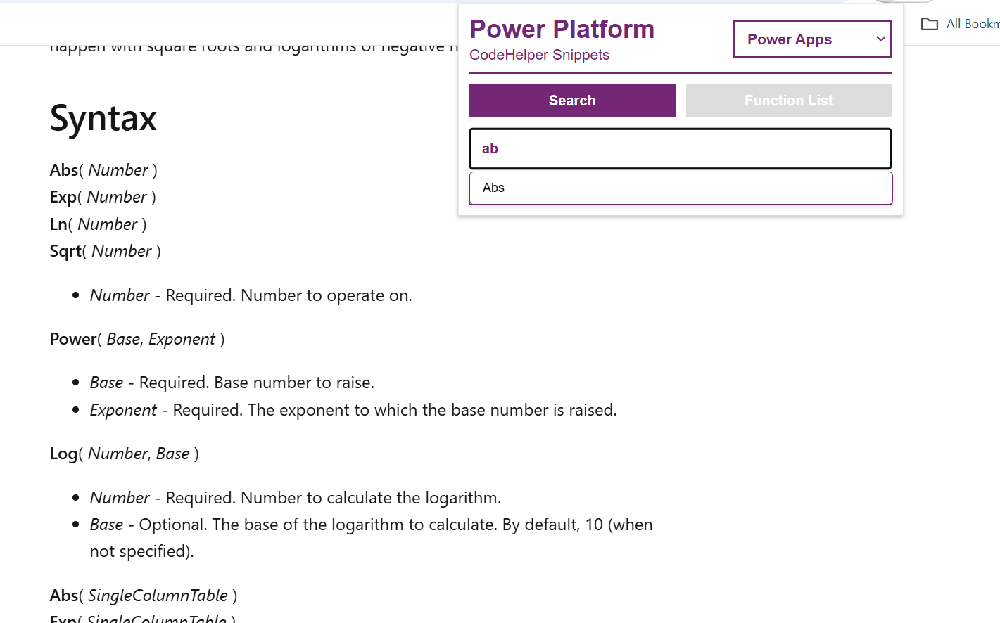
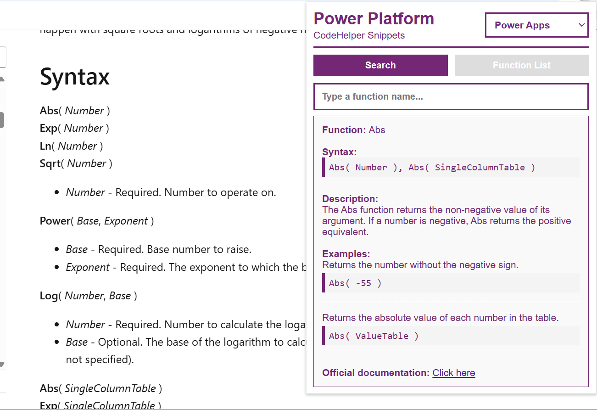
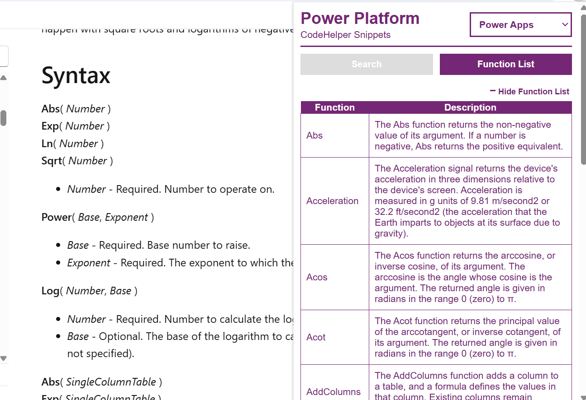

# Power Platform CodeHelper Snippets

**CodeHelper Snippets** is a Chrome Extension designed for developers working with **Microsoft Power Apps** and **Power Automate**. It provides instant access to Power Fx and expression syntax, usage examples, and code snippets — all from your browser toolbar.

---

## ✨ Features

- 🔎 **Function Search**  
  Quickly look up Power Fx and Power Automate functions with real-time autocomplete.

- 📘 **Usage Examples**  
  See syntax, descriptions, and example code for each function.

- 📂 **Function List View**  
  Browse all supported functions in a clean, filterable table.

- 🧠 **Smart Output Display**  
  Results are formatted with function name, description, syntax, example, and links to the offocial documentation.

- 🤖  **Ready for AI integration**  
  Designed with extendability in mind: GPT, API suggestions, Pro templates (coming soon).

---

## 🖼 Extension Preview

### Initial Screen
🔹 ***Initial Screen***

When you load the extension, you'll be prompted to select either Power Apps or Power Automate from the dropdown menu:



🔍 ***Searching for Functions***

After selecting a platform, you'll have two options:

Use the Search tab to find specific functions.

Switch to the Function List tab to browse all available functions in a table format.

As you begin typing in the search field, an autocomplete dropdown will appear with matching function suggestions based on your input:



Clicking on a suggestion will display the full function details, including its description and usage examples:




Clicking on the Function list button will display clicable functions for the selected environment.

📋 ***Viewing All Functions***

By clicking on the Function List tab, you'll see a searchable, clickable table of all available functions for the selected environment:



Each row is interactive, clicking on a function will reveal its full details in the output panel.

---

## 🚀 Installation

### From Chrome Web Store (Coming soon)

1. Visit the Chrome Web Store [PowerPlatform CodeHelper Snippets](#)
2. Click **Add to Chrome**
3. Pin it to your toolbar and start exploring Power Fx faster

### Manual Installation (Development Mode)

1. Clone this repo  
   ```bash
   git clone https://github.com/wallandall/PowerPlatform_CodeHelper-Snippets
2. Open Chrome and Navigate to Extensions Page
    Go to: [chrome://extensions/](chrome://extensions/)
    Or click the three-dot menu → Extensions.
3. Enable Developer Mode
    Toggle the switch at the top right of the Extensions page to enable ***Developer mode.***
4. ✅ Done!
Your extension should now appear in the list and be ready to use.